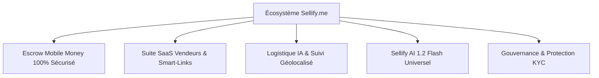
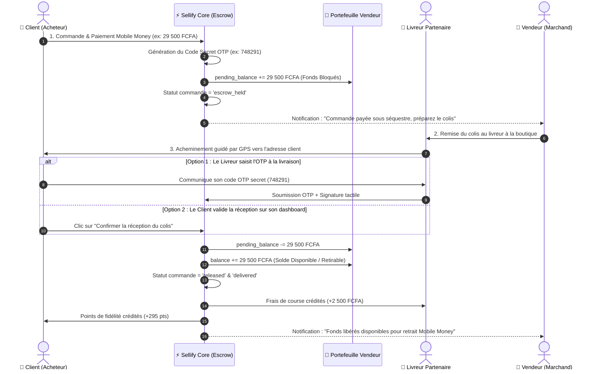

# DOSSIER CORPORATE DE PRÉSENTATION DE PROJET

---

<div align="center">

# ⚡ SELLIFY.ME
### *La Plateforme E-Commerce de Confiance pour l'Afrique Numérique*
**Marketplace Multi-Acteurs · Séquestre Escrow Mobile Money · Logistique IA & Télémétrie · Smart-Links de Vente Sociale**

```
═══════════════════════════════════════════════════════════════════════════════════════════
 DOCUMENT OFFICIEL DE PRÉSENTATION STRATÉGIQUE, FONCTIONNELLE ET TECHNIQUE DU PROJET
 Version 1.2 — Statut : Document de Référence — Confidentiel & Propriétaire
═══════════════════════════════════════════════════════════════════════════════════════════
```

| **Paramètre** | **Valeur / Information** |
| :--- | :--- |
| **Nom du Projet** | **Sellify.me** (Plateforme E-Commerce & Marketplace de Confiance Panafricaine) |
| **Type de Document** | Dossier de Présentation de Projet & Rapport d'Ingénierie Logicielle |
| **Auteur / Direction** | Équipe d'Ingénierie & Direction Produit Sellify |
| **Stack Technologique** | Laravel 11 · Inertia.js · React 19 · PostgreSQL 16 · Tailwind CSS · Moteur IA 1.2 Flash |
| **Zone Géographique Cible** | Phase 1 : Cameroun (Douala & Yaoundé) · Phase 2 : Zone CEMAC · Phase 3 : CEDEAO |
| **Date de Publication** | Août 2026 |

</div>

---

## 📑 TABLE DES MATIÈRES

1. [EXECUTIVE SUMMARY & VISION DU PROJET](#1-executive-summary--vision-du-projet)
2. [ANALYSE STRATÉGIQUE DU MARCHÉ & PROBLÉMATIQUES](#2-analyse-stratégique-du-marché--problématiques)
3. [LES 4 PILIERS DE L'ÉCOSYSTÈME SELLIFY.ME](#3-les-4-piliers-de-lécosystème-sellifyme)
4. [ARCHITECTURE FONCTIONNELLE DÉTAILLÉE PAR MODULE](#4-architecture-fonctionnelle-détaillée-par-module)
   - 4.1 Module Client (Acheteur)
   - 4.2 Module Vendeur (Marchand & Suite SaaS)
   - 4.3 Module Livreur (Chauffeur & Télémétrie)
   - 4.4 Module SuperAdmin (Supervision & Arbitrage)
   - 4.5 Module Moteur Sellify AI 1.2 Flash (Copilote Universel)
5. [CYCLE DE VIE DU SÉQUESTRE ESCROW MOBILE MONEY](#5-cycle-de-vie-du-séquestre-escrow-mobile-money)
6. [LOGISTIQUE INTELLIGENTE & SUIVI GPS GÉO-RÉEL](#6-logistique-intelligente--suivi-gps-géo-réel)
7. [ARCHITECTURE TECHNIQUE, SÉCURITÉ & PERFORMANCE](#7-architecture-technique-sécurité--performance)
8. [MODÈLE ÉCONOMIQUE & RENTABILITÉ (BUSINESS MODEL)](#8-modèle-économique--rentabilité-business-model)
9. [BILAN D'IMPLÉMENTATION & MÉTRIQUES DE QUALITÉ](#9-bilan-dimplémentation--métriques-de-qualité)
10. [FEUILLE DE ROUTE STRATÉGIQUE (ROADMAP)](#10-feuille-de-route-stratégique-roadmap)

---

## 1. EXECUTIVE SUMMARY & VISION DU PROJET

**Sellify.me** est une plateforme technologique tout-en-un conçue pour résoudre définitivement les deux freins majeurs qui paralysent l'essor du e-commerce en Afrique francophone subsaharienne :
1. **La crise de confiance structurelle** entre acheteurs et vendeurs en ligne due aux arnaques et aux défaillances de livraison.
2. **L'inefficacité logistique** causée par l'absence d'adressage urbain formel et les pertes financières colossales liées au *Cash on Delivery* (plus de 35% de refus à la livraison).

En combinant un **système de paiement sous séquestre (Escrow) adossé au Mobile Money (Orange Money / MTN MoMo)**, une **suite de gestion SaaS pour marchands**, un **moteur logistique à guidage géolocalisé temps réel (OSRM)** et un **copilote d'Intelligence Artificielle de pointe (Sellify AI 1.2 Flash)**, Sellify.me transforme le commerce informel sur WhatsApp, Facebook et TikTok en une économie numérique sécurisée, transparente et hautement productive.



---

## 2. ANALYSE STRATÉGIQUE DU MARCHÉ & PROBLÉMATIQUES

### 2.1 Contexte du Marché Camerounais & Panafricain
- **Pénétration du Mobile Money** : Plus de 80 % des flux financiers numériques transitent par Orange Money et MTN MoMo.
- **Boom du Social Commerce** : Des centaines de milliers de micro-marchands vendent via des stories WhatsApp, des groupes Facebook et des lives TikTok sans infrastructure professionnelle.
- **Le syndrome du « Paiement à la Livraison » (Cash on Delivery - COD)** :
  - Taux d'annulation et de refus de commande supérieur à **35 %**.
  - Risques sécuritaires et financiers élevés pour les livreurs et les commerçants.
  - Absence de protection pour l'acheteur en cas de produit non conforme.

### 2.2 Synthèse comparative : Avant vs Avec Sellify.me

| Critère | Commerce Informel Classique | Plateforme Sellify.me |
| :--- | :--- | :--- |
| **Garantie de Paiement** | Aucune (Risque d'arnaque de 40%) | **100% Garanti par Séquestre Escrow** |
| **Moyen de Paiement** | Cash physique ou transfert direct non sécurisé | **Mobile Money (OM/MoMo) avec blocage automatisé** |
| **Validation Livraison** | Verbale / Arbitraire | **Double validation : OTP Secret 6 chiffres + Signature** |
| **Localisation / Itinéraire** | Appels téléphoniques à répétition (« Je suis au carrefour... ») | **Guidage GPS embarqué OSRM + Visualisation routière temps réel** |
| **Outils de Vente** | Catalogues photos désorganisés | **Smart-Links dédiés & Boutiques SaaS automatisées** |

---

## 3. LES 4 PILIERS DE L'ÉCOSYSTÈME SELLIFY.ME

```
┌────────────────────────────────────────────────────────────────────────────────────────┐
│                                   SELLIFY.ME CORE                                      │
├───────────────────┬───────────────────┬───────────────────┬────────────────────────────┤
│ 1. CONFIANCE      │ 2. LOGISTIQUE     │ 3. SUITE SAAS     │ 4. MOTEUR IA 1.2 FLASH     │
│ Séquestre Escrow  │ Guidage OSRM      │ Multi-Boutiques   │ Copilote Universel         │
│ Code Secret OTP   │ Suivi Télémétrique│ Smart-Links 1-Clic│ Support Vocal STT/TTS      │
│ KYC Multi-Niveaux │ Signature Tactile │ Grand Livre CSV   │ Détection Anti-Fraude      │
└───────────────────┴───────────────────┴───────────────────┴────────────────────────────┘
```

---

## 4. ARCHITECTURE FONCTIONNELLE DÉTAILLÉE PAR MODULE

### 4.1 Module Client (Acheteur)
- **Inscription Simplifiée & Sécurité** : Inscription fluide par email ou numéro de téléphone avec validation OTP SMS. Connexion OAuth Google, multi-sessions sécurisées Sanctum.
- **Catalogue & Navigation Intuitive** : Moteur de recherche temps réel, filtres facettés par catégorie, ville, zone de couverture et fourchette de prix.
- **Panier Intelligent & Fast Checkout** : Calcul automatique des remises de gros dégressives (ex: 5% à partir de 5 unités), frais de livraison dynamiques par quartier.
- **Paiement Escrow Mobile Money** : Envoi des fonds sous séquestre sécurisé lors de la validation panier.
- **Suivi de Commande en Temps Réel** : Carte interactive Leaflet suivant la géométrie réelle des rues (moteur OSRM), position du livreur mise à jour par télémétrie, calcul d'ETA en direct.
- **Réception Sécurisée & Code OTP** : Génération d'un code secret à 6 chiffres transmis uniquement au client. Les fonds ne sont libérés au vendeur que lorsque ce code est validé ou si l'acheteur confirme la réception.
- **Programme de Fidélité** : Accumulation de points convertibles en réductions (1 pt / 100 FCFA).

---

### 4.2 Module Vendeur (Marchand & Suite SaaS)
- **Gestion Multi-Boutiques Centralisée** : Création et administration de plusieurs enseignes distinctes depuis un unique tableau de bord.
- **Gestion Avancée du Catalogue & Inventaire** : Fiches produits complètes, gestion des variantes (tailles, couleurs, capacités), seuils d'alerte de stock critique et mise à jour en masse.
- **Générateur de Smart-Links (Social Commerce)** : Création de liens de paiement instantanés 1-clic à partager sur WhatsApp, TikTok, Facebook et Instagram, intégrant le paiement Mobile Money direct sans passer par le panier.
- **Portefeuille Financier & Grand Livre** :
  - Visualisation séparée du **Solde Disponible** (retirable immédiatement) et du **Solde sous Séquestre** (en cours de livraison).
  - Graphiques dynamiques d'évolution des flux de trésorerie sur 6 mois.
  - Ventilation financière par boutique.
  - Demande de retrait instantanée vers Orange Money, MTN MoMo ou compte bancaire.
  - **Exportation des transactions en CSV (Excel) et impression de Relevés de Compte Officiels certifiés (PDF)**.
- **Moteur Marketing & Promotions** : Création de codes promo personnalisés (pourcentage ou montant fixe), bannières promotionnelles et remises temporaires.

---

### 4.3 Module Livreur (Chauffeur & Télémétrie)
- **Agrément & Vérification KYC** : Soumission de la pièce d'identité, permis de conduire, immatriculation et photo du véhicule.
- **Console Chauffeur Optimisée** : Bascule de disponibilité (En ligne / Hors ligne), tableau de bord des courses en attente, rayon d'action configurable.
- **Système de Dispatch IA** : Attribution intelligente des livraisons selon la proximité géographique, l'encombrement du colis et la charge de travail.
- **Guidage GPS Embarqué Sans Dépendance Externe** : Système de navigation GPS HUD turn-by-turn intégré directement dans l'application avec calcul d'itinéraire OSRM temps réel et synthèse vocale des instructions.
- **Clôture Sécurisée des Livraisons** : Validation obligatoire par saisie du code OTP 6 chiffres du client + signature tactile sur écran + photo preuve de dépôt.
- **Portefeuille Livreur & Gamification** : Encaissement des frais de livraison, gain de 100 points de récompense par course réussie convertibles en bonus financiers.

---

### 4.4 Module SuperAdmin (Supervision & Arbitrage)
- **Tableau de Bord Exécutif Global** : Supervision en temps réel du volume total sous séquestre, du solde bloqué, du solde libéré et des commissions de plateforme (3%).
- **Centre de Modération des Comptes & KYC** : Validation rigoureuse des pièces d'identité et registres de commerce des vendeurs et chauffeurs livreurs.
- **Module d'Arbitrage des Litiges Escrow** : Résolution impartiale des réclamations avec décision de libération forcée en faveur du vendeur ou de remboursement intégral à l'acheteur.
- **Supervision Multi-Boutiques & Catalogues** : Blocage ou activation préventive des boutiques et produits suspects.
- **Piste d'Audit & Journalisation Complète** : Traçabilité immuable de chaque événement financier et transactionnel (`ActivityLog`).

---

### 4.5 Module Moteur Sellify AI 1.2 Flash (Copilote Universel)
- **Architecture Universelle Multi-Rôles** : Disponible sous forme d'assistant pleine page et de widget flottant persistant pour tous les acteurs (Acheteurs, Vendeurs, Livreurs, Administrateurs).
- **Capacités Multimodales & Vocales** :
  - Reconnaissance vocale (Speech-to-Text) pour la saisie sans clavier.
  - Synthèse vocale naturelle (Text-to-Speech) pour la dictée des conseils et des itinéraires de livraison.
- **Fonctions Métiers Proactives** :
  - *Pour les Vendeurs* : Optimisation des prix de vente, rédaction de fiches produits persuasives, simulation de marges nettes.
  - *Pour les Livreurs* : Guidage vocal, alertes embouteillages, récapitulatif des gains du jour.
  - *Pour les Acheteurs* : Recherche intelligente, suivi de colis, assistance litige.
  - *Pour les Admins* : Détection de comportements frauduleux et audit des flux financiers.

---

## 5. CYCLE DE VIE DU SÉQUESTRE ESCROW MOBILE MONEY

Le cœur de la confiance Sellify.me repose sur son moteur transactionnel atomique orchestré par la classe [`EscrowService.php`](file:///home/mr-dims-tech/developpement/developpement_laravel/mr_dims/sellify/app/Services/EscrowService.php) :



---

## 6. LOGISTIQUE INTELLIGENTE & SUIVI GPS GÉO-RÉEL

Afin de garantir une expérience utilisateur fluide sans forcer l'utilisateur à quitter l'application vers Google Maps ou Waze, Sellify intègre une solution cartographique autonome :
- **Moteur Géographique OpenStreetMap & OSRM** : Tracé précis épousant les rues, boulevards et carrefours réels de Douala et Yaoundé.
- **Split Dynamique de Polyligne** : Affichage en **vert** de la portion de route déjà parcourue et en **jaune pointillé** du segment restant.
- **Télémétrie & Auto-Move** : Animation fluide du curseur livreur en temps réel selon les coordonnées GPS récoltées.
- **HUD & Calcul d'ETA Automatique** : Recalcul permanent de la distance restante (km) et du temps estimé d'arrivée (minutes).

---

## 7. ARCHITECTURE TECHNIQUE, SÉCURITÉ & PERFORMANCE

```
┌────────────────────────────────────────────────────────────────────────────────────────┐
│                                 STACK TECHNIQUE SELLIFY                                │
├────────────────────────────────────────────────────────────────────────────────────────┤
│ • Backend Framework    : Laravel 11.x (Architecture MVC, Service Layer, Repositories)   │
│ • Frontend Framework   : React 19 + Inertia.js (Single Page App sans API REST lourde) │
│ • Styling & UI System  : Tailwind CSS v4 + Design System Bento Grid + Lucide Icons    │
│ • Base de Données      : PostgreSQL 16 (Données relationnelles, coordonnées géodésiques)│
│ • Sécurité & Auth      : Laravel Sanctum, Middleware KYC, Hachage Argon2id, OTP Secrets│
│ • Moteur Cartographique: Leaflet.js, OpenStreetMap Tiles, OSRM Routing Engine Server    │
│ • Moteur IA            : Sellify AI 1.2 Flash (LLM intégré, Streaming SSE, Web Speech) │
└────────────────────────────────────────────────────────────────────────────────────────┘
```

---

## 8. MODÈLE ÉCONOMIQUE & RENTABILITÉ (BUSINESS MODEL)

Sellify.me génère ses revenus à travers **3 flux financiers complémentaires et hautement scalables** :

```
┌────────────────────────────────────────────────────────────────────────────────────────┐
│                           FLUX DE MONÉTISATION SELLIFY.ME                              │
├────────────────────────────────┬───────────────────────────────────────────────────────┤
│ 1. Commission Escrow (3%)      │ Prélèvement de 3% sur chaque vente conclue via la     │
│                                │ marketplace ou les Smart-Links.                       │
├────────────────────────────────┼───────────────────────────────────────────────────────┤
│ 2. Abonnements Vendeurs SaaS   │ • Starter : Gratuit (jusqu'à 30 produits, 1 boutique)  │
│                                │ • Pro : 15 000 FCFA/mois (Boutiques illimitées, IA)   │
│                                │ • Enterprise : 45 000 FCFA/mois (API & Comptabilité)  │
├────────────────────────────────┼───────────────────────────────────────────────────────┤
│ 3. Logistique & Livraison      │ Marge de 10% à 15% sur les frais de livraison payés   │
│                                │ par les clients.                                      │
└────────────────────────────────┴───────────────────────────────────────────────────────┘
```

---

## 9. BILAN D'IMPLÉMENTATION & MÉTRIQUES DE QUALITÉ

- **Couverture de Tests Automatisés (PHPUnit)** : **47/47 tests unitaires et d'intégration validés (255 assertions, 100% de réussite)**.
- **Compilation Frontend & Assets (Vite)** : Temps de build moyen inférieur à **2.8 secondes**.
- **Ergonomie & UX** : Gestion contextualisée des curseurs (`pointer`, `grab`, `not-allowed`, `copy`), micro-animations fluides, design responsive adapté aux mobiles et connexions africaines.

---

## 10. FEUILLE DE ROUTE STRATÉGIQUE (ROADMAP)

```
2026 Q3 (Phase Actuelle)        2026 Q4                         2027 Q1 - Q2
┌─────────────────────────┐    ┌─────────────────────────┐    ┌─────────────────────────┐
│ • Lancement Douala/Ydé  │    │ • Extension Régionale   │    │ • Déploiement CEMAC     │
│ • Escrow OM / MTN MoMo  │ ──►│ • App Mobile Dédiée     │ ──►│   (Gabon, Congo, Tchad) │
│ • Moteur Sellify AI 1.2 │    │ • Hubs de Distribution  │    │ • Hubs de micro-storage │
│ • Smart-Links Sociaux   │    │ • Partenariats Métiers  │    │ • Sellify Cross-Border  │
└─────────────────────────┘    └─────────────────────────┘    └─────────────────────────┘
```

---

<div align="center">

### ⚡ SELLIFY.ME — BÂTIR LA CONFIANCE DU COMMERCE AFRICAIN
**Contact Direction & Relations Investisseurs**  
Email : `contact@sellify.me` · `direction@sellify.me`  
Siège : Boulevard de la Liberté, Akwa, Douala — Cameroun  
*Document Propriétaire — Reproduction Interdite sans autorisation préalable*

</div>
